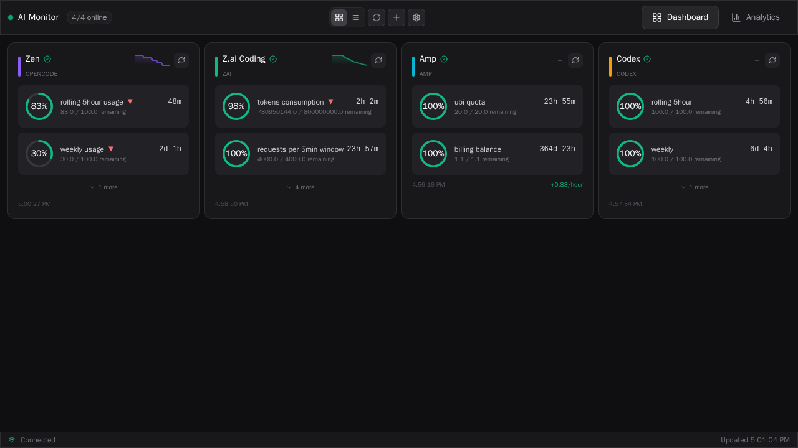
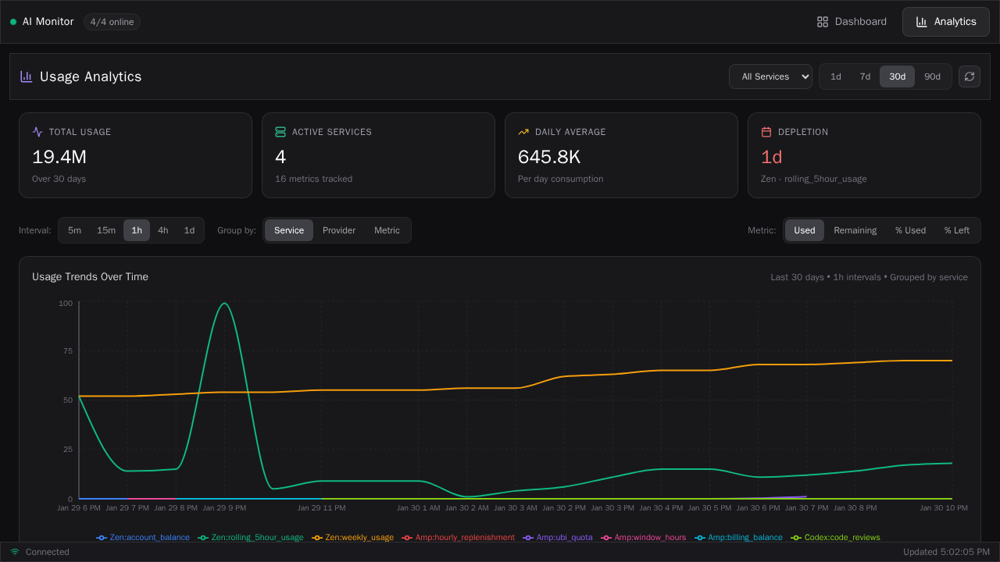

# AI Usage Monitor

A web application that monitors AI service usage across multiple providers in real-time, providing a single-pane view of all your quotas.

## Disclaimer

**This is a personal project intended for local/self-hosted use.**

- **Built-in authentication**: User accounts with session tokens and API keys are enforced by default
- **No encryption at rest**: Service API keys/tokens are stored in plaintext in a local SQLite database
- **Use at your own risk**: The authors are not responsible for any data breaches, API key exposure, or other security incidents

**Recommended usage**: Run on localhost or within a trusted private network. If exposing remotely, place behind a reverse proxy with HTTPS.

## Screenshots

### Dashboard View
The main dashboard provides an at-a-glance view of all your AI service quotas with real-time updates.



*Dashboard showing service cards with quota progress bars, health indicators, and real-time connection status*

### Analytics View
Track usage trends and analyze consumption patterns across all your services.



*Analytics dashboard with time-series charts, provider breakdowns, and usage metrics*

## Features

- **Multi-Provider Support**: Monitor OpenAI, Anthropic, Google AI, Azure OpenAI, AWS Bedrock, opencode zen, AMP, z.ai, and more
- **Real-Time Updates**: WebSocket-powered live updates with automatic refresh every 5 minutes
- **Visual Dashboard**: Progress bars, pie charts, and health indicators for all services
- **Usage History**: Track quota usage over time
- **Easy Management**: Add, edit, and remove services through the web interface

## Architecture

```
ai-usage-quota/
├── shared/           # Effect Schema contracts (API, WS, domain types)
├── backend/          # Node.js + Express + TypeScript
│   ├── src/
│   │   ├── database/    # SQLite database
│   │   ├── middleware/  # Auth middleware
│   │   ├── routes/      # API endpoints (incl. auth)
│   │   ├── services/    # AI provider integrations
│   │   ├── types/       # TypeScript types
│   │   └── utils/       # Helpers (auth, WS, logging)
│   └── data/            # SQLite database files
└── frontend/         # React + TypeScript + Tailwind CSS
    └── src/
        ├── components/    # React components
        ├── hooks/         # Custom React hooks
        ├── services/      # API client helpers
        └── types/         # TypeScript types
```

## Quick Start

### Prerequisites

- Node.js 22.12+ (or 20.19+) and npm
- API keys for the AI services you want to monitor

### Setup

1. **Install Backend Dependencies**
   ```bash
   cd backend
   npm install
   ```

2. **Configure Environment Variables**
   ```bash
   cp .env.example .env
   # Edit .env to adjust port and refresh interval if needed
   ```

3. **Start the Backend**
   ```bash
   npm run dev
   ```
   The backend will start on http://localhost:3001

4. **Install Frontend Dependencies** (in a new terminal)
   ```bash
   cd frontend
   npm install
   ```

5. **Start the Frontend**
   ```bash
   npm run dev
   ```
   The frontend will start on http://localhost:3000

6. **Open the Dashboard**
   Navigate to http://localhost:3000 in your browser

7. **Create your admin account**
   On first run, a setup code is printed to the backend logs. Enter it in the web UI along with a username and password to create the first (admin) account. Registration closes after the first account is created.

### CLI

The backend includes a minimal CLI for fetching cached quota status and printing formatted output.

```bash
npm run cli -w backend -- --url http://localhost:3001/api/status/cached
```

Options:
- `--url <url>`: Full endpoint URL (defaults to `http://localhost:3001/api/status/cached`)
- `--token <token>`: API key or session token (Bearer auth)
- `--auth <user:pass>`: Basic auth credentials (legacy)
- `--username <user>` + `--password <pass>`: Basic auth credentials (alternative to `--auth`)
- `--json`: Print raw JSON output

### Adding AI Services

1. Click "Add Service" in the dashboard
2. Enter a name for the service (e.g., "Production OpenAI")
3. Select the provider from the dropdown
4. Enter your API key
5. (Optional) Enter a custom base URL if using a proxy or custom endpoint
6. Click "Add Service"

The dashboard will automatically fetch and display your quotas.

## Supported Providers

### OpenAI
- Monthly spend limits
- Soft and hard billing limits
- Usage tracking

### Anthropic
- Rate limits (requests/minute, tokens/minute)
- Real-time quota extraction from headers

### Google AI (Gemini)
- Request quotas
- Token quotas
- Daily limits

### AWS Bedrock
- Model-specific quotas
- Regional limits

### opencode zen
**Special Configuration Required**: opencode zen uses SolidJS SSR, so the usage data is embedded in the HTML page rather than exposed via a REST API. **Authentication is required** via session cookies.

To configure:
1. Set the **Base URL** to your workspace billing page: `https://opencode.ai/workspace/WRK_YOUR_WORKSPACE_ID`
2. The workspace ID can be found in your opencode dashboard URL
3. **API Key (Required)**: You must provide your session cookie:
   - Open opencode.ai in your browser
   - Open DevTools (F12) → Application/Storage → Cookies
   - Find the session cookie (usually named `session` or similar)
   - Copy the cookie value and paste it as the API Key
   - Note: Session cookies expire, so you may need to update this periodically

**Monitored Quotas:**
- 5-hour rolling usage percentage and reset time
- Weekly usage percentage and reset time  
- Monthly usage (if limit is set)
- Account balance
- Subscription plan details

### AMP (ampcode.com)
**Special Configuration Required**: AMP uses SvelteKit remote commands for API access. **Authentication is required** via session cookies.

To configure:
1. **API Key (Required)**: You must provide your session cookie:
   - Open ampcode.com in your browser
   - Log in to your account
   - Open DevTools (F12) → Application/Storage → Cookies
   - Find the session cookie
   - Copy the cookie value and paste it as the API Key
   - Note: Session cookies expire, so you may need to update this periodically
2. **Base URL**: Defaults to `https://ampcode.com` (optional)

**Monitored Quotas:**
- Free tier quota (default: 2000 credits)
- Current usage
- Hourly replenishment rate (default: 83 credits/hour)
- 24-hour window tracking
- Remaining credits

### z.ai
**REST API with Bearer Token Authentication**: z.ai uses a standard REST API architecture with Bearer token authentication.

To configure:
1. **API Key (Required)**: You must provide your Bearer token:
   - Open z.ai in your browser
   - Log in to your account
   - Open DevTools (F12) → Application → Local Storage
   - Find the token (key: `z-ai-open-platform-token-production` or `z-ai-website-token`)
   - Copy the token value and paste it as the API Key
   - Note: Tokens expire, so you may need to update this periodically
2. **Base URL**: Defaults to `https://api.z.ai` (optional)

**Monitored Quotas:**
- Time-based limits (requests per time window)
- Token consumption limits
- Model-specific usage (search-prime, web-reader, zread)
- Active subscriptions (GLM Coding Max, etc.)
- Remaining credits and percentages

## API Endpoints

### Authentication
- `GET /api/auth/status` - Check if auth is enabled and if setup is needed (public)
- `POST /api/auth/register` - Create the first admin account (requires setup code)
- `POST /api/auth/login` - Log in with username/password
- `POST /api/auth/logout` - Invalidate current session
- `GET /api/auth/me` - Get current user info
- `GET /api/auth/api-keys` - List API keys
- `POST /api/auth/api-keys` - Create an API key
- `DELETE /api/auth/api-keys/:id` - Delete an API key

All endpoints below require a valid `Authorization: Bearer <token>` header (session token or API key).

### Services
- `GET /api/services` - List all services
- `POST /api/services` - Add a new service
- `PUT /api/services/:id` - Update a service
- `DELETE /api/services/:id` - Delete a service

### Quotas
- `GET /api/quotas` - Get all quotas
- `POST /api/quotas/refresh` - Refresh all quotas
- `GET /api/status` - Get service statuses

### Usage History
- `GET /api/usage/history?serviceId=&hours=` - Get usage history

## Configuration

### Environment Variables (Backend)

```env
PORT=3001                    # Server port
REFRESH_INTERVAL=*/5 * * * * # Cron schedule for auto-refresh (default: every 5 min)
AUTH_SECRET=<random-string>  # Session signing key (auto-generated if omitted; set for stable sessions across restarts, min 16 chars)
```

### Database

The application uses SQLite for data storage. Default path: `backend/data/ai-usage.db` in dev, `/app/data/ai-usage.db` in Docker/production. Override with `DATA_DIR`.

## Development

### Backend Development

```bash
cd backend
npm run dev
```

The backend uses:
- TypeScript with hot reload (nodemon)
- SQLite with better-sqlite3
- Express for REST API
- WebSocket for real-time updates
- node-cron for scheduled tasks

### Frontend Development

```bash
cd frontend
npm run dev
```

The frontend uses:
- React 19 with TypeScript
- Vite for build tooling
- Tailwind CSS for styling
- Recharts for data visualization
- Lucide React for icons

### Linting & Formatting

This repo uses Oxc tools:
- Lint: `oxlint`
- Format: `oxfmt`

From the repo root:

```bash
npm run lint
npm run fmt
```

Or per package:

```bash
npm --prefix backend run lint
npm --prefix frontend run lint
```

### Git Hooks

This repo includes a pre-commit hook that:
- runs Oxfmt on staged files (and re-stages them)
- runs Oxlint on staged files

Enable it once per clone:

```bash
npm run hooks:install
```

### Building for Production

**Backend:**
```bash
cd backend
npm run build
npm start
```

**Frontend:**
```bash
cd frontend
npm run build
```

The frontend build will be in `frontend/dist/`.

### Docker Deployment

Build and run the application using Docker:

```bash
# Build the Docker image
docker build -t ai-usage-quota .

# Run the container
docker run -d \
  --name ai-usage-quota \
  -p 3001:3001 \
  -v $(pwd)/backend/data:/app/data \
  ai-usage-quota
```

The application will be available at http://localhost:3001. Both the frontend and backend are served from the same port, making it easy to deploy behind a reverse proxy.

## Reverse Proxy (Subpath Hosting)

You can host the app under a subpath (for example `https://example.com/ai-usage/`). The frontend detects its runtime base path and will call the backend using that same prefix.

Important: your reverse proxy should *strip the prefix* when forwarding requests upstream so that:
- external `GET /ai-usage/` maps to upstream `GET /`
- external `GET /ai-usage/api/...` maps to upstream `GET /api/...`
- external `GET /ai-usage/version` maps to upstream `GET /version`

Make sure WebSocket upgrades are enabled for the same subpath.

Example nginx config:

```nginx
map $http_upgrade $connection_upgrade {
  default upgrade;
  '' close;
}

server {
  # ...

  location /ai-usage/ {
    proxy_pass http://127.0.0.1:3001/;
    proxy_http_version 1.1;
    proxy_set_header Host $host;
    proxy_set_header X-Forwarded-Proto $scheme;
    proxy_set_header Upgrade $http_upgrade;
    proxy_set_header Connection $connection_upgrade;
  }
}
```

**Environment Variables:**
You can customize the configuration by passing environment variables:

```bash
docker run -d \
  --name ai-usage-quota \
  -p 3001:3001 \
  -v $(pwd)/backend/data:/app/data \
  -e PORT=3001 \
  -e REFRESH_INTERVAL=*/5 * * * * \
  -e AUTH_SECRET=change-me-to-a-long-random-string \
  ai-usage-quota
```

**Using Docker Compose:**

Create a `docker-compose.yml` file:

```yaml
version: '3.8'
services:
  app:
    build: .
    ports:
      - "3001:3001"
    volumes:
      - ./backend/data:/app/data
    environment:
      - PORT=3001
      - REFRESH_INTERVAL=*/5 * * * *
      - AUTH_SECRET=change-me-to-a-long-random-string
    restart: unless-stopped
```

Run with:

```bash
docker-compose up -d
```

## Security Considerations

**Authentication is enforced by default.** On first startup a one-time setup code is printed to the server logs; you must enter it in the web UI to create the first admin account.

- **Built-in auth**: All API routes and WebSocket connections require a valid session token or API key
- **Unencrypted storage**: Service API keys/tokens are stored as plaintext in the SQLite database (`backend/data/ai-usage.db` in dev, `/app/data/ai-usage.db` in Docker)
- **No HTTPS**: The development server runs on plain HTTP
- **No audit logging**: Changes are not tracked or logged

### Security Best Practices

1. Set `AUTH_SECRET` in your `.env` so sessions survive server restarts
2. Place behind a reverse proxy (nginx, traefik) with HTTPS for remote access
3. Restrict database file permissions (`chmod 600 backend/data/ai-usage.db` or `/app/data/ai-usage.db`)
4. Do not store production API keys with high privileges
5. Use API keys (`POST /api/auth/api-keys`) for CLI/programmatic access instead of sharing your session token

## Troubleshooting

### Services show "Error" status
- Verify API keys are correct
- Check that the service is enabled
- Review backend logs for specific error messages
- Some providers may require specific headers or authentication methods

### WebSocket not connecting
- Ensure backend is running on the correct port
- Check firewall settings
- Verify CORS configuration if accessing from a different origin

### Quotas not updating
- Check the refresh interval in your `.env` file
- Manually refresh using the "Refresh All" button
- Verify API keys have the necessary permissions

## Contributing

1. Fork the repository
2. Create a feature branch
3. Make your changes
4. Submit a pull request

## License

MIT
